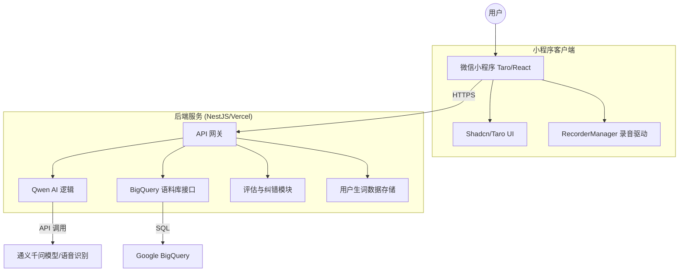

# RealTalk 职场英语实战：小程序迁移技术方案

本文档旨在阐述将现有的 **RealTalk** Web 项目（Next.js）迁移并重构为**微信小程序**的技术路线设计、系统架构及核心技术难点。

---

## 一、 技术路线选择

考虑到当前项目基于 **React** 开发，为了最大程度复用业务逻辑并实现高效开发，建议采用**跨端开发框架**。

### 1. 核心前端框架：**Taro (React)**
- **选择理由**：Taro 支持使用 React 语法开发小程序，与 Next.js 的开发体验高度一致。可以复用大部分 React Hooks（如 `use-vocabulary.ts`）和状态管理逻辑。
- **UI 组件库**：微信小程序不支持所有 HTML 标签，建议使用 `NutUI-React` 或 `Taroify`。
- **样式方案**：使用 **Tailwind CSS**（配合 `weapp-tailwindcss` 插件），确保样式开发体验不降级。

### 2. 后端服务：**独立 Node.js 服务 (NestJS / Express)** 
- **当前现状**：目前后端逻辑运行在 Next.js API Routes 中。
- **迁移建议**：将 AI 生成、BigQuery 检索、评估逻辑抽离为独立的后端服务，部署在腾讯云 Serverless (SCF) 或现有服务器上。小程序通过 `wx.request` 调用。

### 3. 音视频方案 (关键变更)
- **录音 (STT)**：小程序无法使用浏览器的 Web Speech API。需使用微信原生 `recorderManager` 录制音频（通常为 MP3/Silk 格式），上传至后端或对象存储，由后端调用 **DashScope STT API**。
- **播报 (TTS)**：使用微信原生 `InnerAudioContext` 播放 AI 生成的语音流或语音文件。

---

## 二、 总体系统架构

---

## 三、 核心实现步骤

1.  **环境搭建**：初始化 Taro 项目，集成 `weapp-tailwindcss`，迁移全局 CSS 变量。
2.  **Api 适配层**：将原有的 `fetch` 调用改为 Taro 的 `request` 封装，处理小程序的网络请求规范（需配置 SSL 与合法域名）。
3.  **录音机制重写**：
    - 调用 `wx.getSetting` 获取麦克风权限。
    - 使用 `recorderManager` 开始/停止录音。
    - 实现音频分包或整包上传逻辑。
4.  **语料库连接**：小程序端无法直接连 BigQuery（安全风险），所有 BQ 操作必须通过后端中转，保持现有的 API 路由逻辑。
5.  **微信登录集成**：利用 `wx.login` 获取 OpenID，将用户的生词本从 `localStorage` 迁移至数据库存储，实现多端同步。

---

## 四、 核心技术难点与挑战

### 1. 语音交互的实时性 (最大难点)
- **挑战**：Web 端 Web Speech API 是流式实时的。小程序录音后需将整个文件上传、翻译、再由 AI 处理，链路较长。
- **方案**：采用流式分片上传音频，或者在用户录音结束时，通过前端展示“AI 思考中”动画缓冲。后端接入流式响应 (SSE)，但在小程序端解析 SSE 需要特殊技巧（或使用 WebSocket）。

### 2. 样式兼容性与屏幕适配
- **挑战**：小程序的 `rpx` 单位与 Web 的 `px/rem` 不同。Tailwind CSS 需要针对小程序限制进行特殊转换。
- **方案**：开启 Taro 的 `rem` 转换插件，并解决微信内置浏览器对某些 CSS 特性（如透明蒙层、复杂滤镜）的渲染问题。

### 3. 语料库 API 访问 (BigQuery)
- **挑战**：生产环境小程序需要极快的响应。BigQuery 检索可能存在冷启动延迟。
- **方案**：在后端增加缓存层（如 Redis），对常用的分难度语料进行热点缓存，确保用户点击卡片时“秒开”。

### 4. 审核与合规性 (职场政治风险)
- **挑战**：微信对 AI 类、职场类小程序有内容审核要求。
- **方案**：在前端和后端加入关键词过滤系统，确保生成的场景内容符合规范。

---

## 五、 Web 与小程序差异对比

| 特性 | Web 版 (当前) | 小程序版 (设计目标) |
| :--- | :--- | :--- |
| **运行时环境** | 浏览器 (V8) | 微信沙盒 (JSCore) |
| **语音识别** | Web Speech API (系统级) | 原生录音 + 远程录音识别 API |
| **数据存储** | LocalStorage | wx.getStorage / 云数据库 |
| **请求限制** | 无 (需处理跨域) | 必须使用 HTTPS、合法域名、无跨域问题 |
| **部署方式** | Vercel / GitHub Pages | 微信开发者工具发布 / 腾讯云 |

---

## 六、 结论

将 RealTalk 迁移至小程序是非常明智的，它可以更好地利用用户的碎片化时间进行口语练习。**技术路线的核心在于“前后端分离”与“语音方案切换”**。建议初期保留 Next.js 现有的后端作为 API 支撑，前端使用 Taro 进行 React 逻辑的高效复用。
